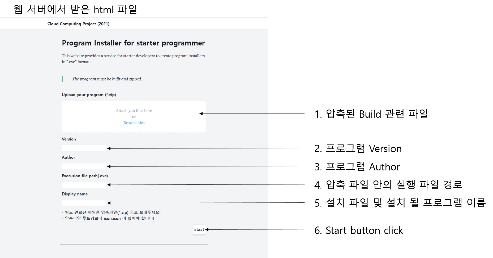

## 21-2 클라우드 컴퓨팅 프로젝트
### A. 프로젝트 명 : 클라우드를 이용한 Setup.exe 생성
---
### B. 팀 구성 및 담당 파트

>- **윤성훈**
>    - 빌드 방법 조사 및 코드 적용
>    - AWS, EC2, AutoScaling, LB 환경 구축
>- **길병헌**
>    - frontend : ...
>    - backend : ...
---

### C. 프로젝트 소개 및 개발 내용 소개
    개발자들은 자신의 프로그램을 다른 사람들과 공유하기 위해 github 같은 커뮤니티를 사용하여 자신의 프로그램을 배포한다. 프로그램을 배포하기 위해 프로그램을 빌드하여 exe 파일을 생성하면, 대부분 실행에 필요한 .dll 파일 같은 종속 파일들이 존재하여 사용하는데 불편함 생긴다. python의 경우 pyinstaller의 onefile 옵션을 사용하여 exe 파일 하나만 생성할 수도 있지만, 이렇게 생성된 파일도 실행시 내부적으로 압축을 풀어 실행하기 때문에 실행 속도의 저하가 생긴다. onefile 옵션을 주지 않는다면 부가적인 소스 파일들이 너무 많아져 지져분해 지는 문제가 있다.

    위와같은 문제점 해결과, 사용자에게 프로그램 관리(추가/제거/변경)에 있어 편의성을 제공하기 위해 installer 를 사용하며 Windows 환경에서 지원하는 install system 은 NSIS 와 Squirrel 등이 있다. 이러한 install system 을 사용하기 위해서는 NSIS 의 경우 전용 스크립트를 짜야하거나, Squirrel 의 경우 C++을 사용해 library를 이용해야 하는 불편함이 존재한다.

    위와 같은 불편함을 해소하기 위해, 누구나 어디에서든지 접근할 수 있는 web platfrom을 통해 Windows 환경에서 작동하는 프로그램 인스톨러를 만들어 service를 제공한다. Web application server 로 flask 를 사용하였으며, 빌드는 Electron-builder를 사용하여 nsis로 빌드하였다.

---
### D. 프로젝트 개발 결과물 소개 (+ 다이어그램)

---
### E. 개발 결과물을 사용하는 방법 소개 (+ 프로그램 구동 화면 스크린 샷 첨부)

     

---
### F. 개발 결과물의 필요성 및 활용방안

Web platfrom 을 통해 간단한 installer 를 만들어주는 service를 이용한다면, 사용자에게는 프로그램을 과 같이 간단하게 설치하고, 제어판에서 삭제할 수 있는 등 쉽게 프로그램을 관리 할 수 있다. 개발 초심자는 사용자 환경과 배포에 신경을 덜 쓸 수 있으며, 원하는 분야 및 목적을 위해 개발에 집중할 수 있게 해준다.
